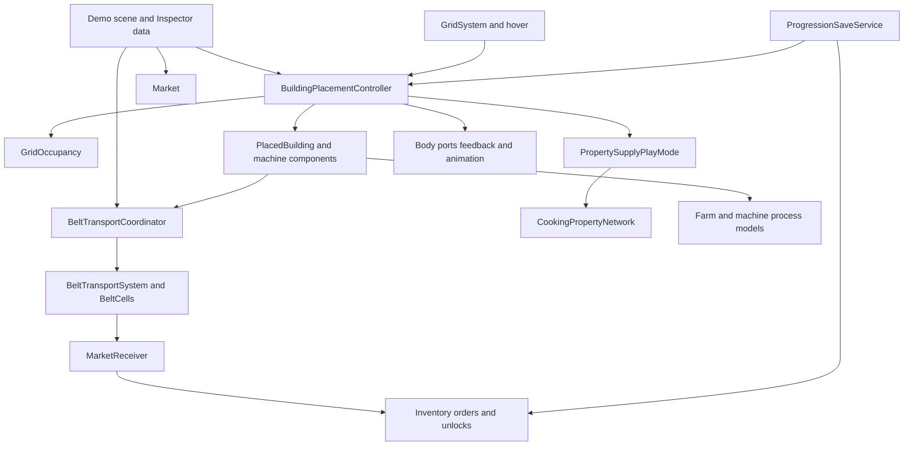

# Cozy Food Factory — Codebase Study Guide

Source study: 2026-09-28, current `main` working copy, Unity **6000.5.2f1**.

This guide explains the implementation you can open and debug today. The [GDD](COZY_FOOD_FACTORY_GDD.md) defines intended gameplay; [ARCHITECTURE.md](ARCHITECTURE.md) is a useful map. Neither replaces inspecting code and Inspector data. This study includes the existing local changes to `Demo.unity` and `Belt.cs`. Those changes were not made by this documentation task.

**Evidence boundary:** methods, data models, and scene settings below were inspected on disk. No Unity compilation, EditMode tests, PlayMode tests, or manual gameplay checks were run for this guide. Test names identify useful existing coverage, not passing results. Exercises should be performed in the already running Editor or by navigating code.

## Contents

1. [Project at a Glance](#1-project-at-a-glance)
2. [Startup and Runtime Architecture](#2-startup-and-runtime-architecture)
3. [Core Systems and Ownership](#3-core-systems-and-ownership)
4. [Gameplay Execution Traces](#4-gameplay-execution-traces)
5. [Important Data Structures](#5-important-data-structures)
6. [Debugging Map](#6-debugging-map)
7. [How to Add or Change Features](#7-how-to-add-or-change-features)
8. [Technical Debt and Design Risks](#8-technical-debt-and-design-risks)
9. [Guided Reading Plan](#9-guided-reading-plan)
10. [Glossary](#10-glossary)

## 1. Project at a Glance

### The playable loop

The supported scene is [Demo.unity](../Assets/_Project/Scenes/Demo.unity), also the sole enabled scene in [EditorBuildSettings.asset](../ProjectSettings/EditorBuildSettings.asset). There is no player character. You configure Farm Plots, cover them with Harvesters, connect Belts, transform food with machines, and deliver it to the Market. Delivery earns currency and advances sequential orders. Unlocks enable crops, machines, and land restoration.

The important distinction is between **a model**, which stores rules and state, and **a Unity component**, which connects those rules to objects in the scene. `FarmPlotProcess` is a normal C# object. `FarmPlot` is a `MonoBehaviour`: Unity creates it on a GameObject and calls its lifecycle methods. The component supplies frame time to the model. This split lets many rules be tested without running a full factory scene.

| Location | What to find |
| --- | --- |
| `Assets/_Project/Scripts/Grid/` | Coordinate conversion, hover detection, map drawing |
| `Assets/_Project/Scripts/Buildings/` | Definitions, placement, occupancy, selection, clipboard, history, Blueprints, presentation |
| `Assets/_Project/Scripts/Logistics/` | Transport contracts, Belt state, transport step, Unity coordinator |
| `Assets/_Project/Scripts/Food/` | Farming, processing, Property network, Market, progression, persistence |
| `Assets/_Project/Scripts/UI/` | Recipe Book/discovery presentation and machine configuration |
| `Assets/_Project/Scripts/Camera/` | Pan, zoom, diagnostic jumps, information levels |
| `Assets/_Project/Prefabs/` | Belt, FarmPlot, DemoFarmPlot, Harvester assets |
| `Assets/_Project/Tests/EditMode/` | Focused NUnit tests for models and component integration |

The runtime [asmdef](../Assets/_Project/Scripts/CozyFoodFactory.Runtime.asmdef) defines `CozyFoodFactory.Runtime`, with `CozyFoodFactory` as its root namespace and a reference to Unity Input System. The [test asmdef](../Assets/_Project/Tests/EditMode/CozyFoodFactory.EditModeTests.asmdef) defines `CozyFoodFactory.EditModeTests`, references runtime, and is Editor/test constrained. An assembly is a compiled group of C# files; a namespace groups type names. Folder names alone do not establish assembly boundaries.

### Implemented versus planned

| Verified current implementation | Intended or unresolved beyond this implementation |
| --- | --- |
| Authored farmable rectangles and fixed Property sources | Procedural distribution of farmland/resources |
| One-property Processor, two-slot Basic Mixer, paired-output Cutter | Multiple-property processing, Advanced Mixer, byproducts/Compost |
| Capacity-based Property connectivity checks | Rate-based flow, storage, allocation and final intersection rules |
| Explicit manual version-2 world save and scene reconstruction | Multiple save slots and autosave timing |
| Construction clipboard, Blueprints, bounded Undo/Redo | Move of equipment with active food/work requires further lifecycle design |
| Optional body/food/Property Sprites and procedural state animation | Final artwork, authored animation clips, Bunny presentation |
| Currency, delivery orders, Basil shop offer and region purchases | Decoration currency, popup events and farming upgrades |

The GDD contains both demo decisions and broader future concepts. Do not infer that a diagram or example recipe in it exists in `Demo.unity`.

### Authored Demo content

Scene data, rather than a central food database, currently supplies these recipes:

| Machine | Inputs | Output |
| --- | --- | --- |
| Processor | `apple` + Air | `Dried Apple` |
| Processor | `Cut Potato` + Heat | `French Fries` |
| Basic Mixer | `tomato` + `onion`, either slot order | `Vegetable Base` |
| Cutter | `potato` | Two `Cut Potato` items |

The five authored delivery orders are First Harvest, Dried Apples, Vegetable Base, Cut Potatoes, and French Fries. East Field restoration is the crop gate between Vegetable Base and potato production. Food IDs such as lowercase `apple` and crop IDs such as `Apple` are different identifiers; copy the actual values rather than normalizing their casing.

## 2. Startup and Runtime Architecture

### Scene wiring

Open Demo and inspect these objects:

| Scene object | Component and role |
| --- | --- |
| Camera | `FactoryCameraController`; orthographic view and input |
| Grid System | `GridSystem`; cell size/origin and coordinate conversion |
| Grid Visualization | `GridVisualization`; visible ground/grid |
| Hover Highlight | `GridHoverHighlight`; cell under the pointer |
| Building Preview | `BuildingPreview`; temporary placement body/ports |
| Building Placement | `BuildingPlacementController`, serialized placement behaviors, `RecipeDiscoveryPanel`, `ObjectivePanel` |
| Market | `Market`, `MarketPanel`; economy/progression and UI |
| Belt Transport | `BeltTransportCoordinator`; transport registration and frame stepping |

`[SerializeField]` means Unity stores a field in scene/prefab data and exposes it in the Inspector even when it is private. Consequently, reading the class defaults is not enough: the scene may override them. Unity assets refer to scripts and other assets by GUIDs from `.meta` files. Preserve these identities when changing code/assets.



Arrows show dependencies/calls, not guaranteed startup order.

### Initialization

1. Unity instantiates scene GameObjects and serialized components. `Awake` initializes local dependencies; `Start` runs before a component's first frame update. Do not assume arbitrary same-order `Awake` methods execute in the order shown in the Hierarchy.
2. `GridSystem` wraps a lazily created `Grid2D`. `FactoryCameraController.Awake` gets its Camera, forces orthographic mode, clamps zoom, and computes its information level.
3. `Market.Awake` requires a transport coordinator, creates `MarketReceiver` and `MarketInventory`, creates `FoodOrderSequence`, `SeedShop`, and `RegionState`, registers the receiver, and creates its visual. Initial region restoration grants the appropriate unlocks.
4. `BuildingPlacementController.Awake` finds its UI components, opens the separate Blueprint Library, reserves the Market cell in occupancy, and constructs `PropertySupplyPlayMode`. That helper reserves fixed source cells and creates their network entries/visuals.
5. The controller installs runtime `ProcessorPlacementBehavior`, `BasicMixerPlacementBehavior`, and `CutterPlacementBehavior` components, configuring them with scene recipes, coordinator, durations, and the shared discovery registry. It assigns them through `BuildingPlacementOption.SetRuntimePlacementBehavior`.
6. `BuildingPlacementController.Start` hides the preview and subscribes to delivery, unlock, order completion, and save events. It consumes any feedback from scene reconstruction.

Processors, Mixers, and Cutters are deliberately constructible without instance prefabs: placement can create an empty GameObject, and the runtime placement behavior adds the machine component. Belt/FarmPlot/Harvester use scene-assigned instance prefabs. This distinction matters to Blueprint resolution; see section 8.

### Frame flow

| Phase | Work |
| --- | --- |
| Early `Update` | `GridHoverHighlight`, with execution order -100, updates pointer/cell information |
| Normal `Update` | Placement/input decisions; FarmPlot and timed machine components advance their process models; camera handles movement/zoom |
| `LateUpdate`, order 50 | `MachineVisualAnimator` observes completed work before transport removes ready machine outputs |
| `LateUpdate`, order 100 | `BeltTransportCoordinator` advances transport and refreshes Belt item visuals |
| `OnGUI` | IMGUI panels/buttons/text fields render and handle GUI events; it can run more than once per frame |

`BuildingPlacementController.LateUpdate` updates world information/feedback presentation. Its relative order against other components with default execution order should not be assumed. Plain process models never receive Unity callbacks themselves.

`FactoryWorldLoadSession.IsReconstructing` suppresses production, transport advancement, and machine animation while restoring a world. A UI input block is a different mechanism: `BlocksAllWorldInput` blocks player interaction; it is not a general simulation pause flag.

## 3. Core Systems and Ownership

### 3.1 Construction: coordinates, definitions, registration, instances

Open [Grid2D.cs](../Assets/_Project/Scripts/Grid/Grid2D.cs), [GridSystem.cs](../Assets/_Project/Scripts/Grid/GridSystem.cs), [BuildingDefinition.cs](../Assets/_Project/Scripts/Buildings/BuildingDefinition.cs), [BuildingPlacement.cs](../Assets/_Project/Scripts/Buildings/BuildingPlacement.cs), and [GridOccupancy.cs](../Assets/_Project/Scripts/Buildings/GridOccupancy.cs) first.

`Grid2D` translates between continuous world positions and integer cells. `GridSystem` exposes it to scene components. A cell is a `Vector2Int`; a world position is usually a `Vector3`. Art positions do not determine occupancy.

`BuildingDefinition` is serialized configuration: stable ID, rectangular bounds, optional explicit occupied cells, instance prefab, visual prefab/Sprite and presentation settings. `BuildingPlacementOption` pairs it with behavior contracts. `IBuildingPlacementBehavior` validates specialized placement and initializes a placed instance. Optional interfaces provide continuous placement and port previews.

`BuildingPlacement` describes a particular anchor, rotation and occupied cells. `GridOccupancy` indexes these registrations by cell. It has separate base and overlay dictionaries so a Harvester can cover a Farm Plot. `PlacedBuilding` is the Unity component that remembers the registration. The controller's `buildingInstances` dictionary connects a registration to the scene object.

The controller calls occupancy and behaviors; those systems do not poll the controller for input. Fixed Property source reservations and the Market also occupy cells, but are not ordinary entries in `buildingInstances`. This explains why an occupied cell need not correspond to a selectable food building.

Modify this layer for footprint rules, placement restrictions, rotation, preview/port alignment, selection or build interactions. Modify a machine process only if the production rule changes.

### 3.2 The construction controller

Open [BuildingPlacementController.cs](../Assets/_Project/Scripts/Buildings/BuildingPlacementController.cs) by searching for a method, not reading it from top to bottom initially.

It owns occupancy, instance lookup, tool state, drag planners, selection, clipboard/group previews, move source lists, construction history, Blueprint UI/library, discovery registry, Property helper, feedback lookup, issue tracking, toasts, and modal/input coordination. It also captures/validates/restores world snapshots.

Its callers include Unity callbacks, HUD buttons, camera/UI queries, and save services. It calls grid conversion, occupancy, specialized placement behaviors, machine components, presentation factories, Property construction and persistence models. This is the main integration point when a feature touches several systems.

Useful entry points:

| Concern | Search for |
| --- | --- |
| Player tool routing | `Update`, `HandleModeInput`, `HandlePlacementInput` |
| Registration/object creation | `CanPlaceBuilding`, `PlaceBuilding`, `CreateBuildingInstance` |
| Selection/clipboard/move | `HandleSelectionInput`, `TryCaptureSelection`, `CanCutDemoSources`, `CanPlaceDemoGroup`, `PlaceDemoGroup` |
| History | `RecordConstruction`, `ApplyConstructionHistory` |
| Persistence | `CaptureWorldSnapshot`, `ValidateWorldSnapshot`, `RestoreWorldSnapshot` |
| Keyboard/UI | `HandleDemoHotbarShortcuts`, `HandleDemoEscape`, `ShouldBlockGameplayKeyboardInput` |

Several helper types live at the bottom of this same file, including `BuildingSelection`, `BuildingGroupCopy`, and rotation/drag helpers. Search for the type name before assuming it has a separate file.

### 3.3 Farming and harvesting

Open [FarmPlotProcess.cs](../Assets/_Project/Scripts/Food/FarmPlotProcess.cs), [FarmPlot.cs](../Assets/_Project/Scripts/Food/FarmPlot.cs), [HarvesterProcess.cs](../Assets/_Project/Scripts/Food/HarvesterProcess.cs), and [Harvester.cs](../Assets/_Project/Scripts/Food/Harvester.cs).

`FarmPlotProcess` owns selected crop, elapsed growth and mature inventory. `FarmPlot` owns that process and its available `CropDefinition` list, checks unlocks, exposes configuration events, and registers itself in a static cell lookup. `Harvester` finds its covered plot using that lookup. There is no direct serialized reference from each Harvester to its plot.

`HarvesterProcess` owns a bounded output queue and harvesting timer. Its component owns the covered cell, rotation-derived output cell and transport registration. Farm growth calls no Belt API: only harvesting creates transportable food. `Harvester.Update` asks the connected plot's process for mature crops; transport later asks the Harvester for buffered output.

Change these files for crop duration/capacity, selection behavior, harvesting rate or buffering. Placement geometry belongs in [HarvesterPlacementBehavior.cs](../Assets/_Project/Scripts/Food/HarvesterPlacementBehavior.cs); farmable-land rules and `RegionState` are in [FarmPlotPlacementBehavior.cs](../Assets/_Project/Scripts/Food/FarmPlotPlacementBehavior.cs).

### 3.4 Item transport

Open [BeltCell.cs](../Assets/_Project/Scripts/Logistics/BeltCell.cs), [BeltTransportSystem.cs](../Assets/_Project/Scripts/Logistics/BeltTransportSystem.cs), [BeltTransportCoordinator.cs](../Assets/_Project/Scripts/Logistics/BeltTransportCoordinator.cs), then [Belt.cs](../Assets/_Project/Scripts/Logistics/Belt.cs).

`BeltTransportSystem` owns dictionaries of Belt cells and receivers, a sorted Belt list, and output source/pair lists. It advances transport deterministically from those models. `BeltTransportCoordinator` is the scene bridge: it owns the system and Belt view lookup, forwards registration/query APIs, supplies frame time, and provides food Sprite lookup. `Belt` holds its registered `BeltCell` and renders food position/identity. No physics collision transfers food.

The contracts let transport work with different machines:

| Contract | Purpose | Current examples |
| --- | --- | --- |
| `ITransportItem` | Payload marker, without production rules | `FoodItemData` |
| `IItemInputReceiver` | Preflight and accept at an input cell/direction | Market, Processor, Cutter, Mixer ingredient ports |
| `IItemInputReservationGroup` | Shared per-step reservation across receivers | Mixer's two input ports |
| `IItemOutputSource` | Peek/take one ready output | Harvester, Processor, Mixer |
| `IItemOutputPairSource` | Peek/take two outputs together | Cutter |

Modify the system for routing, transfer contention or step semantics; the coordinator for scene integration; `Belt` for rendering. A new machine often implements these interfaces without changing the transport algorithm.

### 3.5 Processing and discovery

Read each process before its component: [ProcessorProcess.cs](../Assets/_Project/Scripts/Food/ProcessorProcess.cs)/[Processor.cs](../Assets/_Project/Scripts/Food/Processor.cs), [BasicMixerProcess.cs](../Assets/_Project/Scripts/Food/BasicMixerProcess.cs)/[BasicMixer.cs](../Assets/_Project/Scripts/Food/BasicMixer.cs), and [CutterProcess.cs](../Assets/_Project/Scripts/Food/CutterProcess.cs)/[Cutter.cs](../Assets/_Project/Scripts/Food/Cutter.cs).

Processes own recipe selection, held inputs/output and timers. Components own world cells/directions, registrations, diagnostics and frame integration. Placement behaviors configure them. Port layout classes compute rotated coordinates and are shared by runtime placement and previews.

Catalogs in [ProcessingRecipe.cs](../Assets/_Project/Scripts/Food/ProcessingRecipe.cs), [MixingRecipe.cs](../Assets/_Project/Scripts/Food/MixingRecipe.cs), and [CuttingRecipe.cs](../Assets/_Project/Scripts/Food/CuttingRecipe.cs) count matches. None, unique and ambiguous results are distinct. Recipes are serialized ordinary classes, not a registry of ScriptableObject food assets.

All food machines share the controller-owned [RecipeDiscoveryRegistry](../Assets/_Project/Scripts/Food/RecipeDiscoveryRegistry.cs). Completion records recipe identity once. Discovery is an observation of valid production, not permission to produce. [RecipeDiscoveryPanel](../Assets/_Project/Scripts/UI/RecipeDiscoveryPanel.cs) reads that registry and authored catalogs for the Book, hints, prerequisite navigation and discovery cards.

Modify process/catalog code for transformation rules; component/layout code for ports and integration; registry/panel code for discovery identity and presentation. Changing discovery timing must preserve first-completion semantics and save compatibility.

### 3.6 Property supply

Open [CookingPropertyNetwork.cs](../Assets/_Project/Scripts/Food/CookingPropertyNetwork.cs), then [PropertySupplyPlayMode.cs](../Assets/_Project/Scripts/Food/PropertySupplyPlayMode.cs).

`CookingPropertyNetwork` owns connections by cell and capacities by source cell. Each connection remembers its source owner and Property. Connectivity walks cardinal neighboring conductors; demands consume capacity but do not conduct onward. A disconnected pipe can retain ownership without actually supplying anything.

`PropertySupplyPlayMode` is a normal C# helper, despite its name. The controller constructs it and calls its input/GUI methods. It owns network state, occupancy reservations, connection visuals, fixed source setup and Processor inside-to-outside port mappings. It creates/removes automatic Processor demands during `RefreshProcessorPorts`.

Processors call `TryGetProcessorSupply`. The helper queries `network.IsSupplied`, which requires both connection and total demand within source capacity. Connected idle machines still represent demand. Over capacity currently makes supply unavailable to all connected demands; there is no priority allocator.

Collectors/pipes and food Belts use different models but share physical occupancy. Pipe length has no flow penalty or consumption timer here. `TryAddPipe` overloads and restoration paths have different validation details: read the actual path being used before changing foreign-network rules.

Modify the network for connectivity/capacity rules; the helper for build tools, occupancy, automatic demand integration, visuals or clipboard planning. Multiple Properties per Processor would require a new gameplay decision and coordinated model changes.

### 3.7 Market, progression and regions

Open [MarketReceiver.cs](../Assets/_Project/Scripts/Food/MarketReceiver.cs), [MarketInventory.cs](../Assets/_Project/Scripts/Food/MarketInventory.cs), [FoodOrder.cs](../Assets/_Project/Scripts/Food/FoodOrder.cs), and [Market.cs](../Assets/_Project/Scripts/Food/Market.cs).

The fixed `Market` component owns the receiver, inventory indirectly through that receiver, sequence, `UnlockState`, shop and regions. `MarketInventory` stores cumulative delivered counts, total delivered and currency. Delivery removes food from transport, increments identity counts and credits that item's sell value.

`FoodOrderProgress` records delivery baselines when an order activates. It subtracts those baselines from cumulative inventory counts, so earlier deliveries do not pre-complete future orders. `FoodOrderSequence` owns active/completed order position, grants unlock keys and activates the next order. Order completion provides no bonus currency: sale value already earned on delivery is the currency reward.

`UnlockState` stores category/ID keys and unseen machine/crop badges. `SeedShop` and `SeedShopOffer` live in `Market.cs`; `RegionState` and `FarmableRegion` live in `FarmPlotPlacementBehavior.cs`. Shop purchase and region purchase validate availability/currency before spending. Region eligibility includes cardinal shared-edge adjacency and progression. Farm Plot placement asks `RegionState.CanFarm`; other building placement is not restricted to restored farmland.

`MarketPanel` calls purchase/save/load APIs and renders order/region/economy information. Construction reads unlock state to reject locked machines/crops. Modify authored scene data for order quantities/rewards/prices; models for accounting or eligibility rules; UI for display only.

### 3.8 Persistence, Blueprints and history

Open [ProgressionSave.cs](../Assets/_Project/Scripts/Food/ProgressionSave.cs), [FactoryWorldSnapshot.cs](../Assets/_Project/Scripts/Food/FactoryWorldSnapshot.cs), [BlueprintLibrary.cs](../Assets/_Project/Scripts/Buildings/BlueprintLibrary.cs), and [ConstructionHistory.cs](../Assets/_Project/Scripts/Buildings/ConstructionHistory.cs).

| Mechanism | Owner/callers | Stores | Does not store |
| --- | --- | --- | --- |
| World save | MarketPanel → ProgressionSaveService → controller/models | Progression, placed equipment, food, timers, player Property connections | Camera/tool state, clipboard, Undo stacks, Blueprint Library |
| Blueprint Library | Controller UI → BlueprintLibrary | Named relative construction, rotations, crop configuration, Collector/Pipe kinds/Properties | Food, timers, progression, fixed sources, generated demands |
| Construction history | Controller → ConstructionHistory | Up to 50 before/after construction differences | Food recovery, time travel, currency/order rollback, persistent history |

The version-2 save file is `Application.persistentDataPath/cozy-food-factory-demo.json`; the version-1 Blueprint file is `cozy-food-factory-blueprints.json` in the same directory. `persistentDataPath` is Unity's platform-specific data directory, not `Assets/`. Display/read the actual runtime path when debugging.

World restoration rebuilds a fresh scene. Blueprint placement builds into the current world through group validation. History applies a construction difference to the current live world, so replay can legitimately fail when equipment has become active or dependencies changed.

### 3.9 UI, input and presentation

Open [FactoryCameraController.cs](../Assets/_Project/Scripts/Camera/FactoryCameraController.cs), [ObjectivePanel.cs](../Assets/_Project/Scripts/UI/ObjectivePanel.cs), [MarketPanel.cs](../Assets/_Project/Scripts/Food/MarketPanel.cs), [BuildingVisualFactory.cs](../Assets/_Project/Scripts/Buildings/BuildingVisualFactory.cs), and [MachineVisualAnimator.cs](../Assets/_Project/Scripts/Buildings/MachineVisualAnimator.cs).

UI uses IMGUI (`OnGUI`, `GUI`, `GUILayout`) and Input System's `Keyboard.current`/`Mouse.current`. `ObjectivePanel` is now food machine configuration; the controller's `engraverUpgradePanel` field is its surviving serialized reference name. It is not evidence of active rune gameplay.

The controller aggregates pointer/UI blocks and keyboard focus guards. `BlocksGameplayKeyboardInput` currently targets the focused Blueprint name field. Camera keyboard movement reads this same guard; modal UI reads `BlocksAllWorldInput`. IMGUI uses top-origin screen rectangles while mouse positions use bottom-origin coordinates, so pointer hit tests flip Y.

`BuildingVisualFactory` builds a separate child body, chooses Visual Prefab before Visual Sprite before geometry, normalizes Sprite size, adds port markers, and creates feedback views. Visual scale/offset/upright settings do not change occupied cells or ports. Feedback helpers and `EventToastQueue` are also in this file. `FactoryIssueTracker` stabilizes actionable machine issues rather than treating every idle machine as a fault.

`MachineVisualAnimator` adds an `Animated Parts` child and reads machine state. Farm growth changes its scale; Harvester activity and completed outputs cause reactions; Processor/Cutter motion follows their ability to work. Mixer has no cycle timer, so it uses short reactions. Market subscribes to delivery events. `PropertyActivityVisual` animates Collector presentation from supply status; pipes remain static.

Camera `WorldInformationLod` selects Close/Medium/Far with hysteresis, avoiding rapid switching near a zoom threshold. The controller distributes detail levels and hovered/selected/emphasized overrides. Simulation continues when decorative motion is hidden.

**Current local Belt rendering:** `ItemVisualScale` returns 0.75 Close/detail, 0.50 Medium and 0.12 Far. `SetInformationLevel` and `RefreshItemVisual` force identity labels inactive. `ShowItemIdentity` still returns the old detail decision but no longer decides actual label visibility. Far uses a neutral placeholder unless detail is forced. This differs from older label descriptions in ARCHITECTURE.md and from what the LOD helper test alone can prove.

## 4. Gameplay Execution Traces

These are call paths through the current source. A → B denotes a call or forwarded call; a later frame/event is explicitly identified rather than treated as an immediate call.

### A. Placing a Farm Plot

**Start:** select FarmPlot in the HUD/hotbar and left-click a cell.

1. `SelectBuilding` chooses its option. Controller `Update` resolves hovered cell and uses `CanPlaceBuilding` for preview validity.
2. `CanPlaceBuilding` checks `GridOccupancy.CanPlace` and `CanSatisfyPlacementBehavior`. `FarmPlotPlacementBehavior.CanPlace` requires a 1×1 footprint and `RegionState.CanFarm` for the cell.
3. For a noncontinuous tool, `HandlePlacementInput` captures a construction layout, then calls `PlaceBuilding` only on a valid click.
4. `PlaceBuilding` calls `occupancy.TryRegister`, then `CreateBuildingInstance`. The latter instantiates the configured prefab, creates/initializes `PlacedBuilding`, creates the visual/port markers, and invokes the placement behavior.
5. `FarmPlotPlacementBehavior.InitializePlacedBuilding` initializes the plot with cell and Market unlock state. `FarmPlot.Initialize` creates its process, hooks unlock restoration and enters the static cell lookup.
6. Controller opens `OpenCropPicker` and records construction. Crop selection calls `FarmPlot.SelectCrop`, which validates availability/unlocks and calls `FarmPlotProcess.SelectCrop`.

**Failure:** occupied, locked farmland or non-farmable cells fail preflight. An initialization exception removes the occupancy registration and triggers instance cleanup, then propagates. Crop changes reject unavailable/locked crops. No crop means no growth.

**Result:** registered plot with independent growth state. A selected crop grows in later `FarmPlot.Update` calls. A Farm Plot itself is not an output source.

### B. Placing and rotating a Harvester

**Start:** select Harvester, rotate the tool, point at an existing Farm Plot.

1. Tool input/rotation memory changes `selectedRotation`; `GetPreviewRotation` supplies preview orientation. `HarvesterPlacementBehavior.GetAnchorForFarmCell` converts the clicked Farm Plot cell into the correct minimum anchor for that rotation.
2. `CanPlaceBuilding` takes the Harvester branch. `TryGetHarvesterFarmPlacement` checks both `FarmPlot.GetAt` and underlying occupancy. `occupancy.CanPlaceOver` checks one permitted covered plot and an otherwise free footprint.
3. `PlaceBuilding` uses `occupancy.TryRegisterOver`, then the same instance creation pipeline as other buildings.
4. `HarvesterPlacementBehavior.InitializePlacedBuilding` initializes the prefab's Harvester. `Harvester.Initialize` computes FarmCell using `GetFarmCell`, direction using `rotation.ToGridDirection`, and `OutputCell = FarmCell + direction.ToOffset() * 2`.
5. It creates `HarvesterProcess`, registers an output source and its direction visual.

At 0/90 degrees the covered farm cell is the anchor; at 180/270 it is the opposite end of the rotated bounds. Read the helper formulas instead of guessing based on the rendered Sprite.

**Failure:** missing plot, already covered plot, occupied neighboring cell or missing coordinator/component. The static lookup and occupancy must agree. Rotating art alone cannot change the transport direction.

**Result:** one Harvester overlay covering a plot and pointing beyond its free cell. Removing it leaves the underlying plot. Tool rotation chooses a new placement orientation; it is not an in-place simulation-state rotation command.

### C. Harvesting food onto a Belt

**Start:** plot has an unlocked selected crop; Harvester is initialized; a Belt exists at the Harvester OutputCell.

1. `FarmPlot.Update` → `FarmPlotProcess.Advance(Time.deltaTime)` accumulates duration and increases mature count until capacity. At full capacity, growth stops accumulating usable progress.
2. `Harvester.Update` resolves `ConnectedFarmPlot` → `FarmPlot.GetAt(FarmCell)`, then calls `HarvesterProcess.Advance` with the plot process and frame time.
3. At harvest intervals, that process calls `FarmPlotProcess.TryHarvest`, reducing mature inventory and making a `FoodItemData`, then queues it. Full output capacity pauses harvesting.
4. Later `BeltTransportCoordinator.LateUpdate` → `BeltTransportSystem.Advance` → `TransferSourceOutputs` checks the destination Belt is empty.
5. Transport calls Harvester `PeekOutput`, then `TryTakeOutput`, verifies the returned payload is the same reference, and calls destination `BeltCell.TryAccept`.
6. Belt acceptance creates a `TransportedItem`; `RefreshItemVisual` renders it. Travel starts in subsequent transport advancement.

**Failure/wait:** no selected crop or mature food produces nothing; a missing/occupied output Belt leaves food queued. The source does not send directly to a neighboring Market or Processor: this source-output path requires a Belt.

**Result:** one harvested item leaves the queue and occupies one Belt slot; its identity/sell value are preserved.

### D. Moving food between Belts

**Start:** a Belt contains a `TransportedItem` and points at the next cell.

1. Coordinator `LateUpdate` → system `Advance` advances each wrapper's progress using movement speed and time.
2. `TransferReadyItems` inspects ready items (`Progress >= 1`). It gathers decisions against pre-transfer occupancy, with per-step destination reservations.
3. A target Belt must exist, be empty, and not point directly back at the source. Competing sources cannot both reserve one destination. Belts are considered in the sorted cell order, Y then X.
4. Commit calls source `TakeItem`, then destination `TryAccept` with the existing wrapper and source direction. `TransportedItem.EnterFrom` resets progress and records entry direction.
5. Coordinator refreshes Belt views from the resulting state.

**Failure/wait:** no receiver/Belt at the output, occupied target, head-on Belt or lost contention leaves the ready item at the source. A Belt vacated by another Belt transfer in this same decision batch was occupied during preflight; do not expect instantaneous chain compression. Source/pair outputs run afterward and may use newly freed cells.

**Result:** the same payload and wrapper move one hop. Large frame time does not turn this into repeated arbitrary hops in one `Advance` call.

### E. Delivering food to the Market

**Start:** a ready Belt points at the registered Market InputCell.

1. `TransferReadyItems` finds a receiver rather than a Belt and calls `MarketReceiver.CanAcceptItem(payload, source.Direction)`.
2. Market accepts valid `FoodItemData` and a defined direction. `AllowsConcurrentInput` is true, permitting deliveries from multiple neighboring Belts in one step.
3. Commit calls `MarketReceiver.TryAcceptItem` → `MarketInventory.RecordDelivery`: increments food identity count, TotalDelivered, and Currency by `SellValue`.
4. Receiver fires `FoodDelivered`. Market updates delivery text and forwards its public event; the active `FoodOrderProgress.OnFoodDelivered` checks all requirements against activation baselines.
5. Completion calls `FoodOrderSequence.OnOrderCompleted`: disposes the old progress subscription, adds completed order, grants unlock keys, activates the next order, then raises completion events.
6. On successful receiver acceptance, transport calls source `TakeItem`. UI/animation listeners show the delivery and eventual order/discovery cards.

**Failure:** invalid payload/direction remains on Belt. If receiver behavior changes between preflight and commit, transport treats that contract violation as an exception. Events run synchronously during acceptance; listener side effects therefore matter.

**Result:** sold food no longer exists on a Belt; currency/counts persist in inventory; an order may unlock content. Future orders count deliveries from their own activation time.

### F. Processor receiving food and Property supply

**Start:** placed Processor has its input receiver/output source and Property port registered; a Belt points into its food port.

1. `Processor.Initialize` computes cells/directions through `ProcessorPortLayout`, creates `ProcessorProcess`, registers transport endpoints and calls `PropertySupplyPlayMode.RegisterProcessorPort(inside, outside)`.
2. Property construction (`TryPlaceCollector`/`TryPlacePipe`) reserves cells, modifies the network and runs `RefreshProcessorPorts`. This removes/recreates automatic demands using `TryAddDemand(inside, 1, outside)`.
3. Belt transfer preflight calls `Processor.CanAcceptItem`: correct incoming direction, valid food, idle process, and `TryGetProcessorSupply` are required. `ProcessorProcess.Evaluate` must find exactly one processing recipe.
4. Commit `TryAcceptItem` rechecks conditions, then `ProcessorProcess.TryAccept`. It holds the active recipe/output and Property, sets elapsed time to zero and state to Processing. Only then is the Belt payload removed.
5. Later `Processor.Update` checks current supply still matches ActiveProperty and calls `ProcessorProcess.Advance`. Missing/changed supply pauses progress.
6. At duration, state becomes WaitingForOutput and the discovery registry records the recipe. A later `TransferSourceOutputs` peeks/takes output onto an empty Belt; `TryTakeOutput` clears recipe/output/time and returns state to Idle.

**Failure/wait:** wrong direction, no supplied facing pipe, over-capacity source, nonunique recipe or busy process leaves input on Belt. Completed output waits for a Belt; the Processor cannot accept another ingredient until output leaves.

**Result:** one ingredient becomes one processed food with one Property requirement. Supply is a connectivity/capacity condition, not a Belt item consumed by the recipe.

### G. Mixer combining two ingredients

**Start:** Belts point at Mixer's independently registered A/B IngredientPort receivers.

1. `BasicMixer.Initialize` computes ports with `BasicMixerPortLayout`, creates `BasicMixerProcess`, registers the two nested receivers and one output source.
2. Transfer preflight → `IngredientPort.CanAcceptItem` → component direction/food checks → process `CanAccept` for that slot.
3. With the other slot empty, catalog `CanStart` requires that this food occurs in a recipe. With the other slot filled, catalog `Find` must return one unique unordered ingredient pair. Occupied slot or held output rejects acceptance.
4. Both ports expose the same `InputReservationKey` (the Mixer). Transport permits only one ingredient entry to this machine per transport step, avoiding conflicting simultaneous preflight decisions.
5. Commit → process `TryAccept` fills the slot. When both exist, it assigns recipe output, clears both inputs and records discovery immediately.
6. Later source transfer → `PeekOutput`/`TryTakeOutput` moves the result to a Belt and releases the held output.

**Failure/wait:** invalid or ambiguous second food remains on its Belt; the first ingredient remains in its slot. A blocked output prevents new ingredients. There is no timed BasicMixer Update cycle to debug.

**Result:** two valid ingredients become one buffered result. Pair order is interchangeable; physical port/slot ownership still matters.

### H. Cutter producing two outputs

**Start:** valid ingredient reaches Cutter input; two output Belts may or may not be ready.

1. `Cutter.Initialize` uses `CutterPortLayout`, registers an input receiver and `IItemOutputPairSource`.
2. `Cutter.CanAcceptItem` checks direction, idle state and unique cutting recipe. `TryAcceptItem` → `CutterProcess.TryAccept` retains the recipe and enters WaitingForOutputs.
3. `Cutter.Update` asks `coordinator.CanAcceptOutputPair(OutputACell, OutputBCell)` and passes that availability to process `Advance`.
4. Both different output cells must have empty Belts. Availability changes WaitingForOutputs to Processing; only available paired outputs let elapsed time advance. Blockage pauses the cycle.
5. Completion enters WaitingForOutput (singular enum name) and records discovery. The two outputs are represented by one recipe result and an exact output quantity of two.
6. System `TransferOutputPairs` requires both target slots available, peeks both, takes the pair, verifies references, then accepts one item onto each Belt. `TryTakeOutputPair` resets process to Idle.

**Failure/wait:** invalid/ambiguous input stays upstream; either blocked/missing output stops the timer or holds the completed pair. It never intentionally releases only one half.

**Result:** exactly two transport slots receive identical food data. Sharing an immutable recipe-output reference does not mean only one physical item: each Belt owns a separate wrapper/slot.

### I. Saving/loading a world with food in transit

**Start:** System Menu Save Game or confirmed Load Game invokes MarketPanel.

**Save path:**

1. `MarketPanel.SaveGame` → `ProgressionSaveService.TrySave` → `ToJson` → private `Capture`.
2. Capture gathers inventory, order position/progress, unlocks/unseen flags, shop purchases, discoveries, and controller `CaptureWorldSnapshot`.
3. Controller iterates `buildingInstances`, creates `SavedBuilding` per registration and calls the matching component's `CaptureWorldState`. Belt captures food ID/kind/sellValue plus EntryDirection and Progress. Property helper captures player connections with source owner; fixed sources and generated Processor demands are omitted.
4. `ValidateWorldSnapshot` → `FactoryWorldSnapshotValidator.ValidateAgainstScene` checks shape, supported definitions, occupancy, unlocks, authored recipes and connections against this scene.
5. Save writes UTF-8 JSON to `path + ".tmp"`, then replaces/moves it into the real path. Failure reports an error; success raises `GameSaved`.

**Load path:**

1. `MarketPanel.LoadGame` → `TryReadValidated`. It parses, performs applicable legacy Demo migration and `RestoreSerializedNulls`, validates world and progression without applying them.
2. Missing/malformed/incompatible data returns an error before scene reload. Version 1 uses `TryLoad` for progression only; version 2 uses `FactoryWorldLoadSession.TryBegin`.
3. `TryBegin` requires no load in progress and the current scene in Build Settings. It sets IsReconstructing and calls `SceneManager.LoadSceneAsync` in Single mode.
4. In `OnSceneLoaded`, a new save service calls `ApplySnapshot` to restore progression, then controller `RestoreWorldSnapshot` rebuilds equipment in `ReconstructionOrder`. Farm Plots precede covering Harvesters.
5. Each building goes through normal validation/registration/initialization, then component `RestoreWorldState`. Belt → `BeltCell.RestoreItem` reconstructs wrapper/payload with saved entry direction and fractional progress.
6. Player Property connections are restored after equipment; Processor demands are refreshed. Reconstruction flag clears; later frames resume simulation.

**Failure:** unsupported state/definition, non-food payload, wrong recipe/unlocks, overlap or Demo test demand is rejected. Reconstruction failure logs the actual exception and reloads a clean scene; it does not recover the previous unsaved live factory. If clean reload also fails, simulation remains paused. `TryLoadJson` applies progression but is not itself the complete scene reconstruction path.

**Result:** version-2 reload retains food in transit and machine buffers/timers without re-harvesting or replaying completed output. Camera/tool/history state starts fresh. Disk version changes only through a successful explicit save.

### J. Saving and placing a Blueprint

**Start:** select construction, open Save Blueprint, enter a name.

1. `OpenBlueprintLibraryForSave`/`OpenBlueprintSaveForm` → `TryCaptureSelection` produces a `BuildingGroupCopy` for supported selected parts. `TryGetCopyOption` currently requires an instance prefab, so selections containing prefab-free Processor/Mixer/Cutter definitions fail here. A captured group keeps definitions, relative cell offsets, rotations, crop IDs, and allowed Property construction, not live food/timers.
2. `SavePendingBlueprint` → `BlueprintLibrary.TryAdd`: validates name, assigns GUID record ID, serializes `BlueprintBuilding`/`BlueprintConnection` arrays.
3. `TryWrite` writes a temporary JSON file and replaces/moves the Library file. Only success updates in-memory records and produces the saved toast.
4. In `DrawBlueprintLibrary`, `BlueprintLibrary.TryResolve` maps IDs to current options and validates record bounds/enums/shape. It currently also requires each matched definition to have a non-null InstancePrefab.
5. A resolved record enters `EnterGroupPasteMode`; `HandleGroupPasteInput` previews `CanPlaceDemoGroup`. That preflight checks locks, crops, occupied cells, overlays and `TryPlanClipboardConnections` against destination Property sources.
6. Click → `PlaceDemoGroup`: validates again, captures history, places Farm Plots before Harvesters, selects copied crops, then places planned connections. Failure removes newly placed parts; success records one construction action and exits paste mode.

**Failure:** unsupported Library version/malformed top-level data makes the Library read-only; incompatible individual records remain stored but unavailable. Runtime-built machines with no instance prefab currently fail selection capture or resolution. Valid definitions can still fail destination occupancy, crop unlocks or source ownership. The temporary clipboard is separate from the Library.

**Result:** fresh construction and crop settings, with empty production/transport state. Saved Property ownership is planned against the new destination rather than blindly copying a live source reference.

### K. Undoing and redoing construction

**Start:** construction is recorded; player invokes Undo/Redo.

1. Before construction, controller `CaptureConstructionLayout` calls `ConstructionLayout.FromWorld`. It copies placement/crop/connection configuration while replacing runtime state with empty defaults.
2. `RecordConstruction` computes `before.Difference(after)` → `ConstructionHistory.Record`. Empty differences are ignored; new actions clear redo; undo list is capped at 50. Drag/batch operations use suppression to avoid one record per cell.
3. `HandleConstructionHistoryShortcut` → `TryUndo(ApplyConstructionHistory)` or `TryRedo(ApplyConstructionHistory)`. Undo expects the action's After layout and requests Before; Redo reverses those arguments.
4. `ApplyConstructionHistory` rejects unfinished tools, changed expected construction, active food/work, broken external Property dependencies, and unavailable/locked desired content. It validates a candidate combined world through `ValidateWorldSnapshot`.
5. A crop-only change can call `FarmPlot.SelectCrop` on the existing empty/idle plot. Pure removal removes the expected parts. Other replay constructs a group, plans it, and calls `PlaceDemoGroup` with history recording suppressed.
6. The stack moves the record only if apply returns true. Rejection preserves the record and supplies `constructionMessage`.

**Failure/wait:** food or growth can start after construction, making Undo unsafe. Property pipes may now support other machines. A desired destination may be blocked, including original source cells still occupied during group preflight. No food is recovered by undoing demolition.

**Result:** a permitted construction change is reversed/reapplied. This is construction history, not rewind of simulation or progression, and it is not saved to disk.

## 5. Important Data Structures

### Identity versus a transported instance

The essential nesting is:

```text
Belt MonoBehaviour (Unity view/registration)
  └─ BeltCell (cell, output direction, one occupied slot)
       └─ TransportedItem (payload, entry direction, progress)
            └─ ITransportItem → FoodItemData (ID, kind, sell value)
```

In [TransportedItem.cs](../Assets/_Project/Scripts/Logistics/TransportedItem.cs), the core fields are exposed as:

```csharp
public ITransportItem Item { get; }
public GridDirection EntryDirection { get; private set; }
public float Progress { get; private set; }
```

Food is the payload; progress belongs to the wrapper. Changing food art should not change either payload identity or transport progress.

| Type | Role and important relationship |
| --- | --- |
| `FoodItemData` | Validated ID/kind/sellValue. Equality/hash use ID and kind, not sellValue; inventory and recipe matching depend on that identity. Not a GameObject. |
| `ITransportItem` | Generic transport marker. It does not guarantee the food snapshot codec can save every implementation. |
| `TransportedItem` | Runtime carrier for one Belt slot. EnterFrom resets travel; saved files store its fields, not its C# type name. |
| `BeltCell` | One item max; immutable cell/direction and computed output cell. Accept/take/restore govern slot ownership. |
| `BuildingDefinition` | Reusable configuration. Footprint bounding rectangle and explicit occupied cells can differ (Processor L shape). Visual size is independent. |
| `BuildingPlacementOption` | Definition plus behavior and optional port/continuous-placement contracts. Runtime behavior can replace the serialized behavior reference. |
| `BuildingPlacement` | Particular registration, rotation and occupied cell set; key to controller instance lookup. |
| `PlacedBuilding` | Unity bridge storing that registration on the instantiated object. |
| `GridOccupancy` | Base/overlay cell indexes; occupancy authority shared by equipment, Market and Property reservations. |
| `CropDefinition` | Crop identity, output food, production duration and required crop unlock, serialized in Farm Plot assets. |
| Recipe definitions/catalogs | Authored input/output data; catalogs return none/unique/ambiguous and never choose arbitrarily among matches. |
| `DiscoveredRecipe`, `RecipeDiscoveryRegistry` | Recipe identity, discovered/unseen collections and events; supplied to all machine processes. |
| `UnlockKey`, `UnlockState` | Category + ID identities; acquired and unseen state for progression/UI. |

### Machine state ownership

| Model | Persistent live state | What releases held state |
| --- | --- | --- |
| `FarmPlotProcess` | Selected crop, elapsed time, mature count | Harvest decrements mature count; changing crop resets work/inventory |
| `HarvesterProcess` | Elapsed interval, output queue | Successful transport takes queued output |
| `ProcessorProcess` | Idle/Processing/WaitingForOutput, active recipe/Property/output, elapsed time | Output taken resets to Idle |
| `BasicMixerProcess` | Slot A, Slot B, held output | Unique pair clears inputs immediately; output taken clears output |
| `CutterProcess` | Idle/WaitingForOutputs/Processing/WaitingForOutput, active recipe, elapsed time | Paired output taken resets to Idle |

Enum state is a named phase of a state machine. Read transition methods to find allowed changes; a displayed diagnostic such as NeedsProperty is not necessarily a separate process enum state.

### Property and persistence models

`PropertyConnection` is a readonly value with Cell, SourceCell, Property, Kind, Units and optional RequiredConnectionCell. `PropertyConnectionKind` distinguishes Source, Collector, Pipe and Demand. `PropertySupplyStatus` describes source capacity and connected demand. Ownership and connectivity are separate facts: SourceCell can remain valid while a pipe section is disconnected.

`ProgressionSaveData` is version 2 and includes progression plus `FactoryWorldData`. World arrays contain `SavedBuilding` and `SavedPropertyConnection`; each building has exactly its matching state record (`SavedFarmPlot`, `SavedHarvester`, `SavedBelt`, `SavedProcessor`, `SavedMixer`, `SavedCutter`). `SavedFood` includes ID, kind and sellValue. Progression delivery/order counters instead store identity/count through `SavedDelivery`.

These are **DTOs** (data transfer objects): plain serializable fields used to move data between runtime and JSON. They are not running machines. `FactoryWorldSnapshotValidator` checks DTOs before runtime reconstruction and repairs only recognized `JsonUtility` null-placeholder patterns. Unused inline serializable classes can round-trip as empty objects; arbitrary empty-looking input should not bypass strict validation.

Blueprint DTOs are `BlueprintFile` (version/records), `BlueprintRecord` (ID/name/parts), `BlueprintBuilding` (definition/relative position/rotation/crop), and `BlueprintConnection` (relative position/Property/kind). `BuildingGroupCopy` is their resolved construction counterpart. `ConstructionLayout` and `ConstructionChange` are history configuration snapshots and differences, not full factory snapshots.

## 6. Debugging Map

Start with the failing layer. Check an actual state value before changing a condition. Source tests below live in [Tests/EditMode](../Assets/_Project/Tests/EditMode/); run them in the existing Editor's Test Runner when verifying a behavior change.

| Symptom | First file/method | State to inspect and likely defect categories | Related tests |
| --- | --- | --- | --- |
| Building cannot be placed | Controller `CanPlaceBuilding`; occupancy `CanPlace` | Correct anchor/rotation/explicit footprint? Market/source reservation? Machine lock? Farm region? Specialized behavior? Distinguish invalid placement from missing prefab/component initialization. | `GridOccupancyTests`, `FarmPlotTests`, `HarvesterPlacementTests`, `ProcessorPortLayoutTests` |
| Harvester covers wrong cell/output | `HarvesterPlacementBehavior.GetAnchorForFarmCell`/`GetFarmCell`; `Harvester.Initialize` | Compare clicked farm cell, registered anchor, direction and output at all four rotations; static plot lookup versus occupancy. | `HarvesterPlacementTests`, `HarvesterTests` |
| Food does not move on a Belt | `BeltTransportSystem.Advance`/`TransferReadyItems` | Registered cell? Payload/progress? Correct output neighbor? Head-on direction? Destination occupied/reserved? Receiver rejects direction/recipe? IsReconstructing? Rendering motion can differ from logical state. | `BeltTransportTests.ReadyFood_WaitsWhenNextBeltIsOccupied`, `OppositeFacingBelts_BlockFoodWithoutBounceBack`, `FoodItemTransportTests` |
| Harvester produces no Belt food | `HarvesterProcess.Advance`; `TransferSourceOutputs` | Crop selected/unlocked, mature count, elapsed interval, output cap, actual output Belt exists/free. Check FarmPlotProcess separately from transport. | `HarvesterTests`, `FarmPlotTests` |
| Processor holds food but does not run | `Processor.Update`; process `Advance`; supply `TryGetProcessorSupply` | Processing or completed? Supply currently same as ActiveProperty? Disconnected facing pipe or over capacity? Elapsed time paused versus output waiting? | `ProcessorProcessTests`, `CookingPropertyNetworkTests` |
| Mixer rejects second ingredient | `BasicMixerProcess.CanAccept`; `MixingRecipeCatalog.Find` | Correct physical slot/direction, first slot identity, unordered pair unique, held output, shared input reservation. No timer exists. | `BasicMixerTests.UniqueRecipeIsUnorderedAndInvalidOrAmbiguousPairsStayUnconsumed`, `TwoPortsKeepOwnershipAndBlockedOutputReachesMarketAfterBeltIsAdded` |
| Cutter stops with one blocked output | `Cutter.Update`; `CanAcceptOutputPair`; process `Advance` | Both different output cells require empty Belts. Check rotated port layout, elapsed/state and pair registration. Pausing here is intended. | `CutterTests.CutterPausesAtCompletionAndEmitsExactlyTwoItems`, `PairedTransportWaitsForBothBeltsAndTransfersTogether` |
| Property appears connected but supplies nothing | Helper `GetProcessorSupplyMessage`; network `IsSupplied` | Required outside cell, conductor type, source owner, BFS connectivity, capacity versus total connected demand. Sprite adjacency is not proof of connection. | `CookingPropertyNetworkTests.ProcessorDemand_OnlyConnectsAtItsFacingPipeCell`, `DemandBeyondCapacity_IsReportedWithoutAllocatingConsumers`, `SeparateSources_CannotMergeEvenWhenTheyShareAProperty` |
| Blueprint cannot resolve/place | `BlueprintLibrary.TryResolve`, controller `CanPlaceDemoGroup`, helper `TryPlanClipboardConnections` | Separate missing definition/prefab incompatibility from destination failures. Check crop unlock, overlay order, Property kind/source remapping, occupied cells and actual returned message. | `Ux06FactoryScaleTests.BlueprintLibrary_InvalidRecordRemainsVisibleButCannotBePlaced`, `BlueprintLibrary_EmptyCropIdOnNonFarmBuildingIsNoCrop`; `ProcessorProcessTests.PropertyClipboard_RemapsCollectorToMatchingSourceAtDestination` |
| Undo/Redo refuses an action | `ApplyConstructionHistory`; `ConstructionHistory.TryUndo`/`TryRedo` | Changed expected layout, current tool, active items/growth, Property dependents, source occupancy, locked target. Stack retained on failure is expected. | `Ux06FactoryScaleTests.History_FailedReplayKeepsStackAndNewActionClearsRedo`; component state tests; manual full history replay |
| Save/load loses or rejects buildings/food | `TryReadValidated`, `ValidateAgainstScene`, `RestoreWorldSnapshot`, `FactoryWorldLoadSession.OnSceneLoaded` | Read error before guessing: version, definition IDs, prefab/behavior, food value/kind, state record, unlock/recipe, overlay order, fractional Belt state. Compare disk file with capture, not only live HUD. | `ProgressionSaveTests.OccupiedBeltRestore_KeepsPayloadEntryAndProgress`, `ReconstructionOrder_PlacesPlotBeforeOverlayRegardlessOfFileOrder`, `ProcessRestore_PreservesTimersBuffersAndOccupiedInput`, `SerializedNullRepair_RejectsNonemptyMismatchedStateWithLocation` |
| Market counts/orders wrong | `MarketInventory.RecordDelivery`; `FoodOrderProgress.GetDeliveredCount` | ID+kind equality, item value, activation baselines, sequential order index, event subscriptions. Lifetime deliveries and active progress differ. | `MarketDeliveryTests`, `FoodOrderTests`, `ProgressionSaveTests` |
| Machine art/animation wrong | `BuildingVisualFactory.Create`/`ApplyRotation`; animator `Initialize`/`LateUpdate` | Visual Prefab precedence, Sprite bounds, offset/scale, transparent footprint corner, body sorting, upright flag, actual component/state, LOD/forceDetail, feedback decision. Inspect visual child separately from gameplay transform. | `ProcessorProcessTests.MachineAnimationDecisions_PausesBlockedMotionAndHidesFarDetail`, `PropertyVisuals_MissingAndPartialArtworkKeepAllConnectionsVisible`; manual rotations/zoom |
| Shortcuts trigger while typing | Controller `ShouldBlockGameplayKeyboardInput`/`Update`; camera `Update` | Blueprint library/panel/focus state, pointer conversion, modal versus keyboard block, hotkey priority. | `Ux06FactoryScaleTests.BlueprintTextFocus_BlocksGameplayShortcutsOnlyWhileFocused` |
| Belt identity text disagrees with LOD helper | Belt `SetInformationLevel`/`RefreshItemVisual` | Local code disables label GameObject directly; `ShowItemIdentity` is insufficient evidence. Assert/view actual rendered label if changing it. | `Ux06FactoryScaleTests.BeltLod_ChangesRenderedItemScaleAndIdentityVisibility` examines helper decisions; manual rendering still needed |

### A productive debugging sequence

1. Record the exact cell, rotation, food ID/kind, process state and error message.
2. Follow the real caller: preview validation, transport preflight, commit, or load validation can each reject independently.
3. Place breakpoints on the smallest rule (`CanAccept`, catalog `Find`, `IsSupplied`) and on its integration caller.
4. Inspect registration dictionaries if a component exists visually but has no logical effect.
5. Use a focused existing test for the rule; add a test only for the changed behavior or missing invariant.
6. Verify scene references/import, rotated ports, UI and lifecycle behavior manually in the running Editor. A model test cannot prove Inspector wiring or visual appearance.

## 7. How to Add or Change Features

These are integration maps, not instructions to implement deferred gameplay. Author configuration in the Editor where possible; preserve `.meta` GUIDs and serialized identities. A new catalog entry should be exercised both as valid content and against ambiguous matching.

| Change | Minimum integration points | Cross-system effects and checks |
| --- | --- | --- |
| Raw ingredient | `CropDefinition`/food identity; available crops on Demo's assigned Farm Plot prefab | If gated, add appropriate UnlockKey reward or shop offer. Check crop ID versus output food ID, production duration/value, farm selection, harvesting, save/load. Optional coordinator food Sprite entry. Use FarmPlot/Harvester/Market/save tests. |
| Processed food | Author valid `FoodItemData` output in a scene recipe | ID/kind/sellValue must agree across downstream recipes/orders. It needs no new MonoBehaviour just to be food. Check matching ambiguity, transport, discovery and snapshot restore; optional Sprite lookup. |
| Recipe | Demo controller `processorRecipes`, `mixerRecipes` or `cutterRecipes`; corresponding definition/catalog class for a new rule | Ensure exactly one match. Discovery registry/panel and save validation use authored recipes. Removing/changing an old recipe can invalidate saved active work or discoveries. Run process, discovery and save tests. |
| Machine | Definition/option, `IBuildingPlacementBehavior`, component/process, rotated layout, transport contracts | Add scene tool/unlock/UI/feedback integration. Current hard-coded save and construction switches need a state model/validator/restore path; Blueprint resolution needs a compatible definition/prefab. Add rotation, invalid-input, blocked-output, lifecycle and round-trip tests. |
| Property consumer | Network demand integration and dedicated port coordinates; helper registration/supply API patterned after Processor | Do not assume the generic network requires a Processor. Helper is currently Processor-specific. Specify units/facing cell, register/unregister, capacity diagnostics, occupancy and save/generated demand behavior. Test connectivity, over capacity, source isolation and removal dependencies. |
| Building Sprite | Building Placement object's option → `BuildingDefinition.VisualSprite` or VisualPrefab | Import PNG as a Sprite with centered pivot. Visual Prefab takes precedence. Scale/offset are presentation settings. Use transparency over Processor's empty corner/Harvester plot; verify all rotations, preview, sorting, LOD and saved reconstruction. No production code required for body art. |
| Machine animation | `MachineVisualAnimator`/`MachineAnimationDecisions`; visual child/prefab; `PropertyActivityVisual` for Collector | Read state without modifying timers/ports/occupancy. Observe before transport consumes output; suppress initial/load reactions and Far detail. Keep root transform fixed. Test decision rules and manually inspect work/pause/output/zoom transitions. |
| Market order | Market object's `orders` array: `FoodOrder`, requirements, unlock keys | Order IDs/order sequence are saved compatibility keys. Do not reorder old content without migration. Baseline counting, next guidance, crop/shop/region unlocks and Recipe Book hints may depend on its requirements. Run order/Market/save tests. |
| Build hotkey | Controller `HotbarBuildingIds`, `HandleDemoHotbarShortcuts`, `SelectBuilding`, HUD slot rendering | Handler explicitly maps digits 1–6; array growth alone does not add key handling. Preserve lock checks, Ctrl/history shortcuts, typing guard, group mode and tool priority. Manually check pointer/UI and focused name entry. |

### Example: adding one recipe without changing the machine

For another existing single-Property transformation, start with the Processor Recipes array on Demo's controller. Supply valid input/output FoodItemData and a Property. Search that food identity in authored downstream recipes/orders. Then read `ProcessingRecipeCatalog.Find`: duplicate matching input/Property combinations are ambiguous, even if you intended one as an alternative output. Check `ProcessorProcess` unique match and discovery completion, then `FactoryWorldSnapshotValidator` and save discovery validation for compatibility. Art is optional and comes last through coordinator Food Visuals.

### Example: increasing transported food size or removing its text

Food art lives in the coordinator's Food Visuals list, matched by food ID. Rendered Belt size lives in `Belt.ItemVisualScale` and `RefreshItemVisual`, which normalizes the longest Sprite bounds dimension. Adjusting the import pixels-per-unit alone may be canceled by this normalization. Label activation lives in `SetInformationLevel`/`RefreshItemVisual`. The current local working copy already enlarged the Close/Medium scale and disables labels; inspect that code before making another change. These settings do not affect Belt capacity or transport speed.

## 8. Technical Debt and Design Risks

The following are evidence-backed development risks. They are not a request to refactor, nor a claim that all listed paths currently fail in Play Mode.

### Highest practical impact

1. **Construction integration is concentrated in a large controller.** `BuildingPlacementController` combines input, IMGUI, construction transactions, persistence bridges and presentation. Adding a machine can require changes to creation, snapshots, history, group operations, feedback and hotkeys. Use its method map and trace a neighboring feature before editing; a small method can depend on several controller flags.
2. **Registration and Unity destruction have different timing.** Occupancy removal is immediate, while `Destroy` completes later. Belt/model registrations and the static FarmPlot lookup are cleaned through component lifecycle methods. `CreateBuildingInstance` explicitly uses `IBuildingMoveState.DetachForMove` when initialization fails. A visual object disappearing is not proof that transport/network/static lookup already released it. Validate failed initialization, cancellation and same-frame replacement when changing lifecycle.
3. **Active-item Move is deliberately restricted.** `HasActiveDemoItems` includes food, nonidle machines, mature crops and FarmPlot/Harvester elapsed work. `CanCutDemoSources` also checks covering Harvesters and Property dependents. Copy captures configuration and can create empty equipment; it does not duplicate live inventory. `PlaceDemoGroup` builds destinations before removing sources, so source cells remain occupied during preflight. Overlapping replacement/move/history cases need explicit investigation; removing the activity gate alone would not create safe rollback.
4. **Save compatibility spans authored content and code.** Definition IDs, food IDs/kinds, recipe identities, order IDs/order sequence, crop availability/unlocks, source setup and state schemas participate in validation. A rename or scene edit can invalidate a file despite compiling successfully. Version 1/2 and legacy Demo migration do not imply an automatic migration for future changes. Reconstruction failure recovers a clean scene, not the previous unsaved factory.

### Specific compatibility and coverage gaps

5. **Clipboard/Blueprint support disagrees with prefab-free machine creation.** Both controller `TryGetCopyOption` and `BlueprintLibrary.TryResolve` require `candidate.Definition.InstancePrefab != null`. Demo currently serializes null InstancePrefab for Processor/BasicMixer/Cutter; controller Awake adds placement behaviors, and creation can add components to an empty object. Therefore selection capture rejects these parts, and stored Blueprint records containing them fail resolution as missing buildings, even though ordinary placement can construct them. This is a concrete source/data mismatch; reproduce Copy and Library save/resolve in the running Editor before choosing a fix. Existing resolver tests do not establish that every authored Demo option resolves.
6. **History cannot guarantee every inverse remains applicable.** It strips simulation state, validates expected construction against the current world and refuses active/dependent changes. Blueprint/group placement is recorded as construction, but named Library edits themselves are not a world Undo action. New construction clears redo. Source-first removal cannot simply replace the current destination-first path without considering rollback and food preservation.
7. **Presentation has some diagnostic/text dependencies.** Processor animation reads `MachineFeedbackView.Feedback` for the working decision. Mixer reaction observes `LastEvent` text beginning with `"Output "`. Changing diagnostic refresh/text can affect motion without changing production. Keep this coupling in mind when revising UI strings or feedback timing.
8. **Current Belt helpers and rendered labels differ.** The dirty Belt implementation disables actual labels while `ShowItemIdentity` retains its earlier logic. The LOD test checks helper properties, so its name does not prove the renderer's current label activation. Inspect the visual GameObjects when verifying this presentation change.

### Further maintainability boundaries

9. **Unity serialization is part of the API.** Scene GUID references, assembly-qualified class identifiers, private serialized field names and prefab crop arrays must remain consistent. The old `engraverUpgradePanel` name is still an active food panel reference. Renaming it casually risks losing Inspector data; changing a namespace is broader than replacing text in a C# file.
10. **Property validation has multiple paths.** Preview copy, clipboard planning, direct placement and restore have different goals. `TryRestoreConnection` allows disconnected sections to retain owners; Processor demands are regenerated. Some explicit-owner pipe paths differ from ordinary adjacency/foreign-source checks. Reproduce the exact path and ownership rather than imposing a new intersection rule globally.
11. **Connectivity queries can repeat substantial work.** `TryGetStatus` traverses conductors and scans demands; `IsSupplied` performs additional connectivity checks. Several Processors and presentation updates can query this per frame. This is a potential scale cost visible in code, not a measured bottleneck. Profile a large real factory before introducing caches; invalidation must cover construction/removal/restore/demand changes.
12. **IMGUI layout/input depends on shared flags and fixed rectangles.** `OnGUI` may run several times per frame, while keyboard input is polled in Update. Camera and construction need consistent focus/modal guards. Narrow-window overlap and future text fields need manual checks; the existing Blueprint guard is not a universal text-focus service.

## 9. Guided Reading Plan

Each session is about **30–45 minutes**. Spend roughly 10 minutes on the model, 10 on callers/state transitions, and 10–20 answering questions and completing the exercise. Navigate source first; do not edit as part of the study.

| Session | Files | Concepts and questions to answer | Navigation/debugging exercise |
| --- | --- | --- | --- |
| 1. A food item on one Belt | `Food/FoodItemData.cs`, `Logistics/ITransportItem.cs`, `TransportedItem.cs`, `BeltCell.cs`; then first transport tests | What is food identity? What stores progress? Why separate payload from wrapper? Why can equality ignore sale value? | Follow `ReadyFood_TransfersToAvailableNextBeltWithoutChangingFoodItemData` in BeltTransportTests; sketch the two cells and wrapper before/after transfer. |
| 2. Grid and occupancy | `Grid/Grid2D.cs`, `GridSystem.cs`; `Buildings/BuildingDefinition.cs`, `BuildingPlacement.cs`, `GridOccupancy.cs` | What is anchor versus center? Why can a 2×2 bound occupy three cells? What distinguishes base and overlay? | Compute Processor occupied cells at 0/90 degrees, compare layout tests, then trace `TryRegisterOver` for one Farm Plot. |
| 3. Farm to buffered output | `Food/CropDefinition.cs`, `FarmPlotProcess.cs`, `HarvesterProcess.cs`, then components/placement behavior | Why does FarmPlot not output to Belts? Where do growth/harvest pause? Who finds the connected plot? | Follow `TryHarvest` into FoodItemData creation and locate every registration/removal of the static plot lookup. |
| 4. One transport step | `Logistics/BeltTransportSystem.cs`, coordinator and interfaces | Why preflight before commit? Why one receiver reservation group? What order do ready/source/pair transfers use? | Draw a three-Belt occupied chain, predict one Advance result, and compare `ThreeBeltChain_MovesFoodToFinalBelt` and blocked-target tests. |
| 5. One food transformation | `Food/ProcessingRecipe.cs`, `ProcessorProcess.cs`, `Processor.cs`, `ProcessorPortLayout.cs` | What rejects ambiguous recipes? When is input consumed/discovery recorded? Where is paused Property supply checked? | Trace an apple/Air input through `CanAcceptItem`, `TryAccept`, `Advance`, `TryTakeOutput`; write the process state after each. |
| 6. Mixing and paired outputs | `Food/MixingRecipe.cs`, `BasicMixerProcess.cs`, `BasicMixer.cs`; `CutterProcess.cs`, `Cutter.cs`, pair transport | Why no Mixer timer? Why only one input per transport step? Why does Cutter require both output Belts? | Follow Mixer's shared reservation key, then `PairedTransportWaitsForBothBeltsAndTransfersTogether`; predict behavior when one output is removed. |
| 7. Property connectivity | `Food/CookingPropertyNetwork.cs`, `PropertySupplyPlayMode.cs`, Processor registration | How is source ownership different from supply? Why must the facing cell contain a conductor? What happens over capacity? | Use `ProcessorDemand_OnlyConnectsAtItsFacingPipeCell` to identify inside/outside cells; remove a connecting segment conceptually and trace BFS. |
| 8. Delivery and unlocks | `Food/MarketReceiver.cs`, `MarketInventory.cs`, `FoodOrder.cs`, `Market.cs`, region/shop models | Why don't old deliveries count toward new orders? Who credits currency? Which unlock category enables a crop versus access to land? | Follow one delivery through all completion events; locate the five scene order IDs and East Field reward without changing data. |
| 9. Placement integration | Relevant controller sections, `BuildingPlacementOption.cs`, placement behaviors, preview | Which checks are generic versus specialized? Why runtime machine behaviors? What gets cleaned when initialization throws? | Follow trace A with source search; map occupancy, instance dictionary, static plot lookup and visual creation separately. |
| 10. Save and reconstruction | `Food/FactoryWorldSnapshot.cs`, `ProgressionSave.cs`, controller capture/restore, MarketPanel save/load | Why fresh scene? What survives version 2? Why repair JsonUtility placeholders narrowly? What is rollback actually recovering? | Find `OccupiedBeltRestore_KeepsPayloadEntryAndProgress`; follow its DTO fields into `RestoreItem`, then identify preflight versus reconstruction errors. |
| 11. Clipboard, Blueprints, history | `Buildings/BlueprintLibrary.cs`, `ConstructionHistory.cs`, controller group/history methods | Why configuration-only copies? What leaves a Library read-only? When does Undo retain its record? | Compare Demo Processor option with `TryResolve` predicate; then read failed-replay test and list three legitimate history rejection conditions. |
| 12. UI and visual observation | Camera, ObjectivePanel, RecipeDiscoveryPanel, visual factory, animator, PropertyActivityVisual, FactoryIssueTracker | What reads versus writes simulation? How are typing/modal blocks different? Why observe output before transport? | Locate the animated child in source, track execution orders, and compare Belt label activation with `ShowItemIdentity`; manually inspect all LOD levels if desired. |

**Start with session 1.** After it, you should explain a transported food using only four terms: payload, wrapper, slot and direction. This vocabulary makes every subsequent machine and save trace easier to understand.

## 10. Glossary

| Term | Meaning in this project |
| --- | --- |
| GameObject | Unity scene object containing components and a Transform |
| MonoBehaviour | Unity component with callbacks such as Awake/Update/OnDestroy |
| Plain C# model | Object created with `new`, called explicitly; no automatic Unity lifecycle |
| Awake / Start | Initialization callbacks; do not infer arbitrary component ordering from the Hierarchy |
| Update / LateUpdate | Per-frame callbacks; explicit execution order puts hover early, animation before transport |
| OnGUI / IMGUI | Immediate-mode interface code, possibly invoked several times in a frame |
| SerializeField | Makes a field part of Unity asset/Inspector data |
| Prefab | Reusable serialized GameObject hierarchy; instance prefab may contain gameplay, visual prefab should represent presentation |
| Sprite / SpriteRenderer | Imported/generated 2D image asset and component drawing it |
| Transform | Position, rotation, scale and parent relationship; visual children can move without moving gameplay ports |
| GUID / .meta | Stable Unity asset identity stored beside a file; used by serialized references |
| asmdef | Defines a compilation assembly and dependencies for its source subtree |
| Interface | Contract describing callable behavior, such as receiving or producing transport items |
| Anchor | Grid position from which rotated building geometry is computed |
| Footprint / occupied cells | Bounding dimensions versus actual cell set reserved by a building |
| Overlay | Harvester registration permitted over an underlying Farm Plot |
| Payload / wrapper | Food data versus its per-Belt travel state |
| Buffer | Held food waiting for work/output; queue for Harvester, slots/output for machines |
| Preflight / commit | Decide whether action is allowed, then mutate state; both stages can validate |
| Reservation | Per-step transfer claim, or persistent cell occupancy, depending on context |
| State machine | Named phases and allowed transitions, such as Processing → WaitingForOutput |
| Event / subscription | Notification invoking registered handlers; handlers must be detached at lifecycle boundaries |
| BFS | Breadth-first graph traversal using a queue; used to find connected Property conductors |
| Source owner / demand | Environmental node identity assigned to a connection; capacity requested by consumers |
| Snapshot / DTO | Serializable data describing state at a moment; not the live objects themselves |
| Reconstruction | Creating/registering fresh objects and restoring their saved state |
| LOD / hysteresis | Reduced visual information at zoom distance; a threshold band prevents rapid toggling |
| EditMode / PlayMode | Unity test contexts; source inspection or offline compilation is neither a passing Unity test run nor gameplay verification |

Use this guide as a route into code. When an observed result disagrees with it, inspect the current working copy and Inspector values first, then follow the exact preflight, commit and lifecycle path involved.
